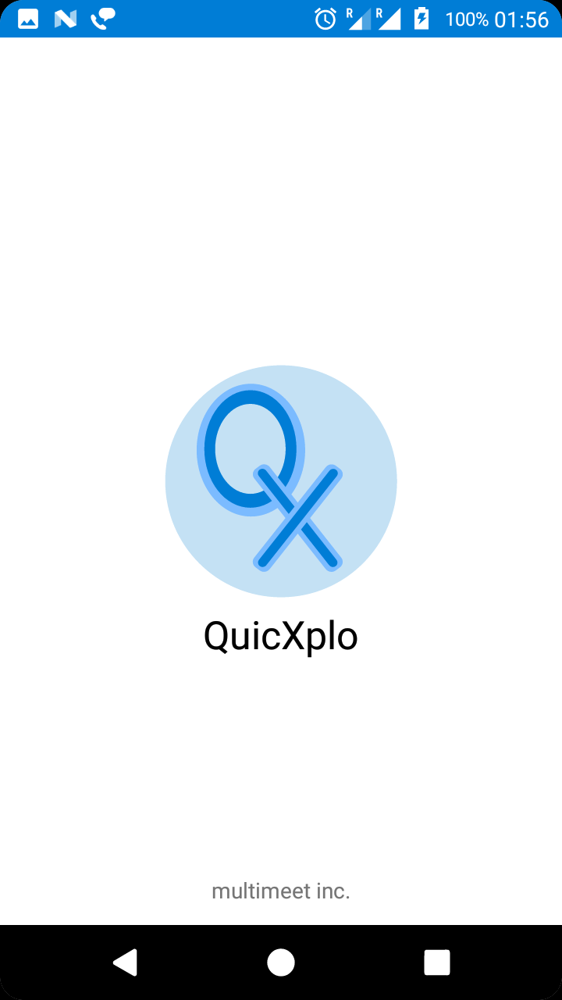
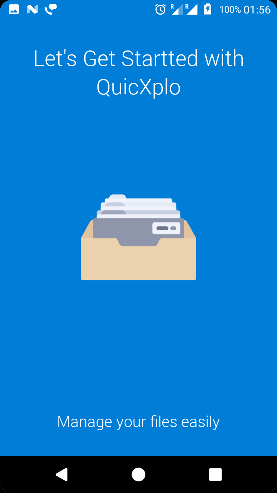
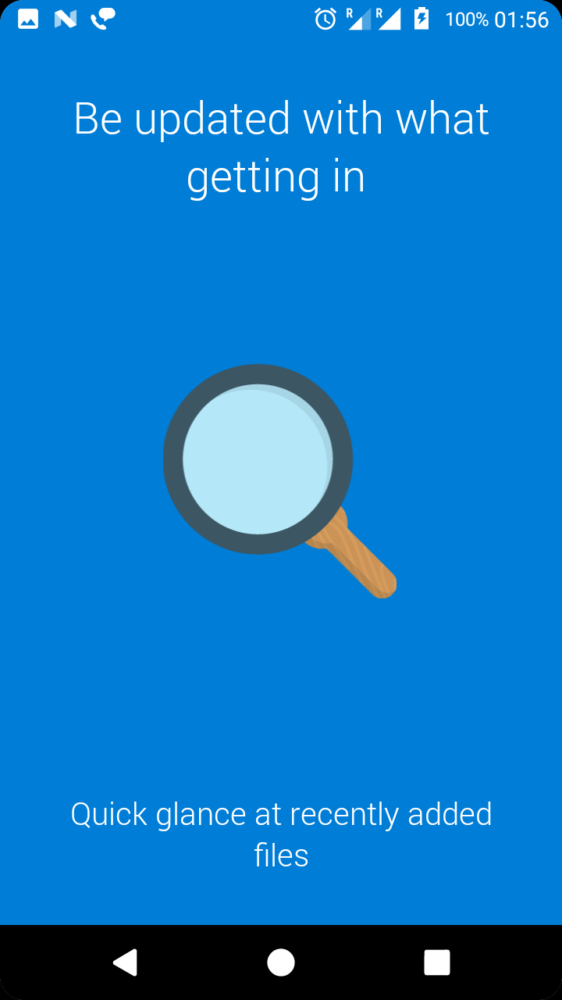
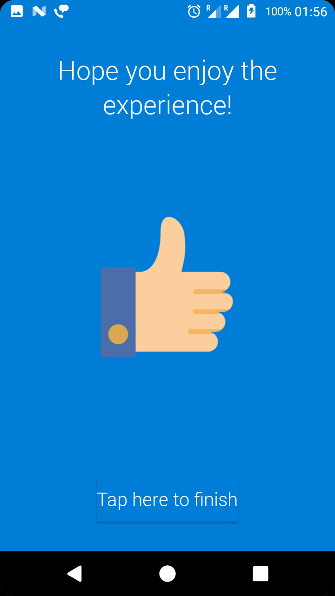
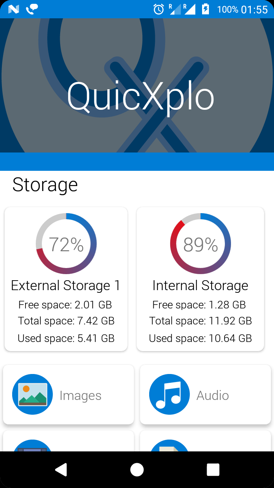
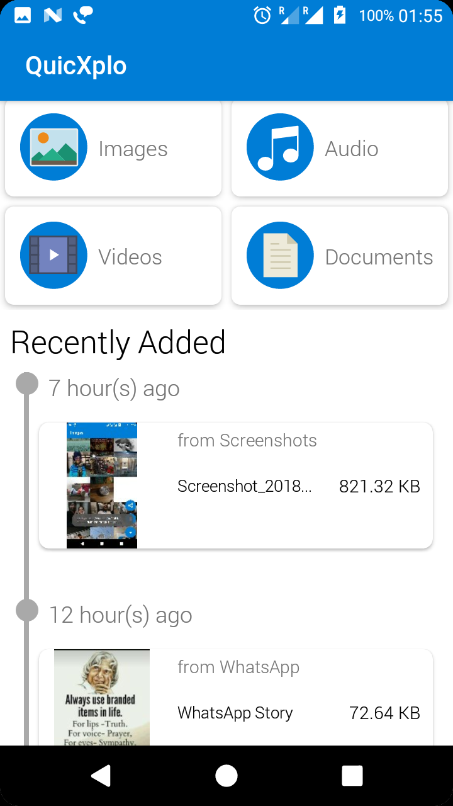
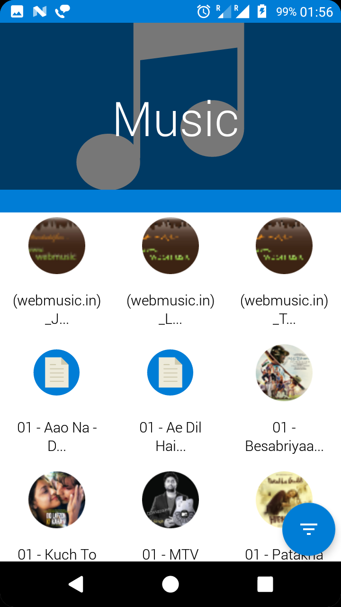
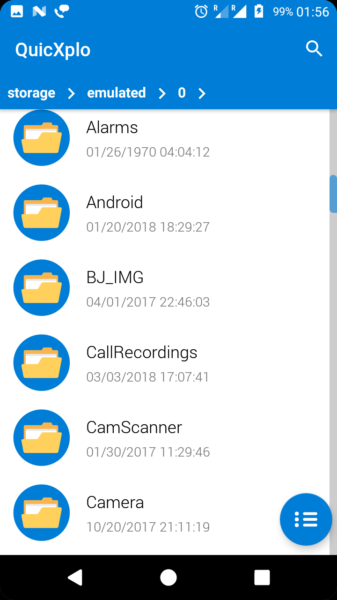
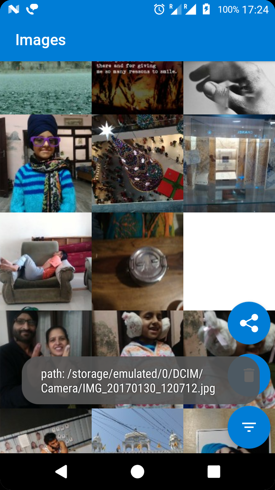

# QuicXplo
QuicXplo is an file manager for android devices. It offers all core functionalities of a typical file manager. Go and check the app on play store https://play.google.com/store/apps/details?id=com.singh.multimeet.quicxplo

## Screenshots

